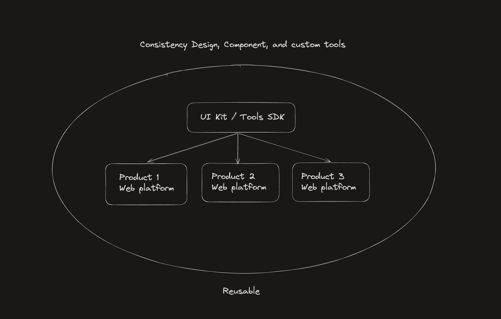

# Introduction To UI Kit

## Why?

This repository includes built-in components and was created by UI Designers and also to maintain the design consistently without changing any existing design or branding on Bitwyre.

It was created based on design principles and the brand presented and means developers do not need to create components from scratch because this SDK was created for several existing projects specially for our web platform.



### Apps and Packages

- `web`: web playgrounds with [Next.js](https://nextjs.org/) app
- `@bitwyre/ui-kit`: a stub React component library
- `@bitwyre/eslint-config`: `eslint` configurations (includes `eslint-config-next` and `eslint-config-prettier`)
- `@bitwyre/typescript-config`: `tsconfig.json`s used throughout the monorepo

Each package/app is 100% [TypeScript](https://www.typescriptlang.org/).

### Utilities

This Turborepo has some additional tools already setup for you:

- [TypeScript](https://www.typescriptlang.org/) for static type checking
- [ESLint](https://eslint.org/) for code linting
- [Prettier](https://prettier.io) for code formatting

### Build

To build all apps and packages, run the following command:

```
cd .
pnpm build
```

### Develop

To develop all apps and packages, run the following command:

```
cd .
pnpm dev
```

### Remote Caching

Turborepo can use a technique known as [Remote Caching](https://turbo.build/repo/docs/core-concepts/remote-caching) to share cache artifacts across machines, enabling you to share build caches with your team and CI/CD pipelines.

By default, Turborepo will cache locally. To enable Remote Caching you will need an account with Vercel. If you don't have an account you can [create one](https://vercel.com/signup), then enter the following commands:

```
cd .
npx turbo login
```

This will authenticate the Turborepo CLI with our [Vercel account](https://vercel.com/docs/concepts/personal-accounts/overview).

Next, we can link our Turborepo to our Remote Cache by running the following command from the root of our Turborepo:

```
npx turbo link
```

© Copyright By Bitwyre Engineering Teams.
